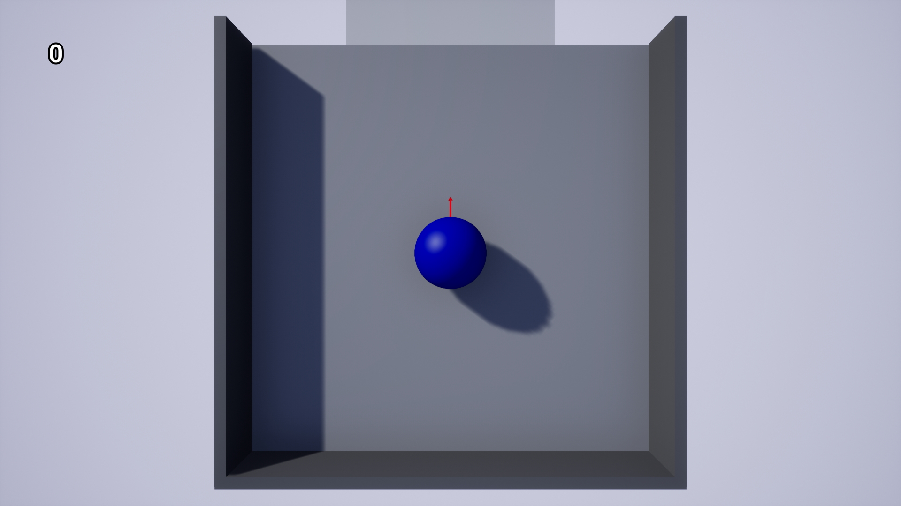
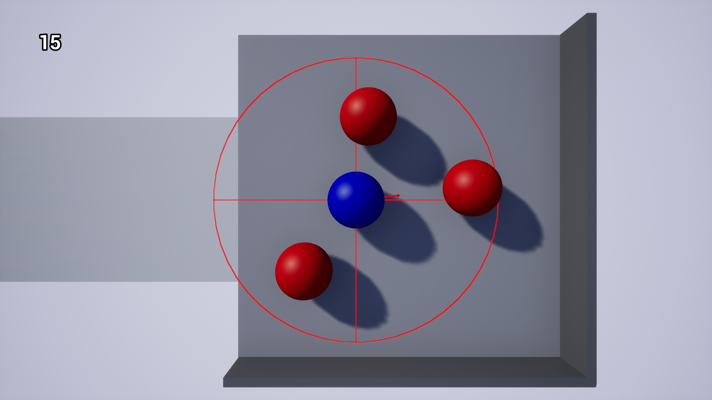
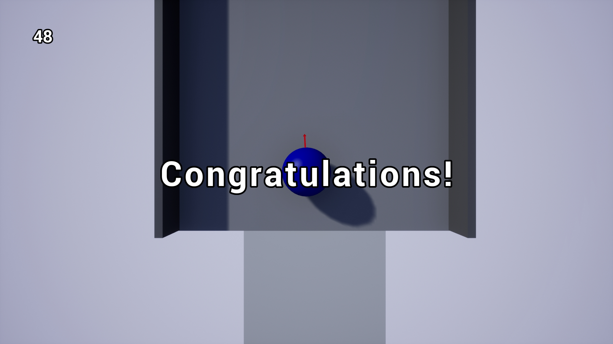

# Rolling Ball

🕹️ This is a small project, demonstrating a game conception. It was developed in purposes of getting experience of working with unusual controls, experimenting with mechanics of interaction with environment and enemies and getting more experience of creating different game objects.    

🔵 The ball, controlled by player, should destroy all enemies and reach end of level. The player can choose direction of movement and then hold button to accumulate impulse which will be applied to the ball when the button is released. Levels consist of platforms and bridges between them. Platforms have walls which make player bounce off them on hit. If the player falls out of the platform, he returns to the level start.  
To destroy enemies player should use an ability which on activation destroys all enemies in specified range with 0,1 sec interval strictly clockwise relatively to player current direction. Some enemies spawn bridges on death. These bridges lead to platforms which were unavailable earlier.  

Here is a [link](https://drive.google.com/drive/folders/1GnQLk1ppTPRVVYBzgpJuRR7SQZ1lrM4B?usp=sharing) to last version of the game (need to download the folder and run .exe file).   
  
  
  
